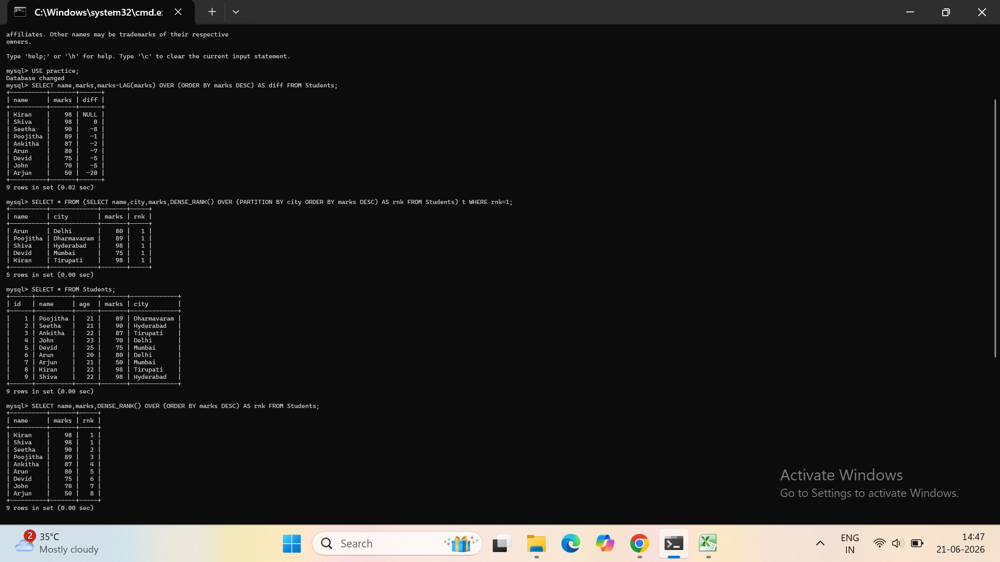

# 📊 Student Data Analysis using SQL

## 📌 Project Overview
This project analyzes student marks data using SQL queries to extract insights.

## 🛠 Tools Used
- SQL
- Excel (for dataset)

## 📂 Dataset
Contains student names, subjects, and marks.

## 🔍 Key Analysis
- Average marks of students
- Highest scoring student
- Subject-wise performance

## 🚀 How to Run
1. Create table using schema.sql
2. Import dataset.csv
3. Run queries.sql

##Output Screenshot

